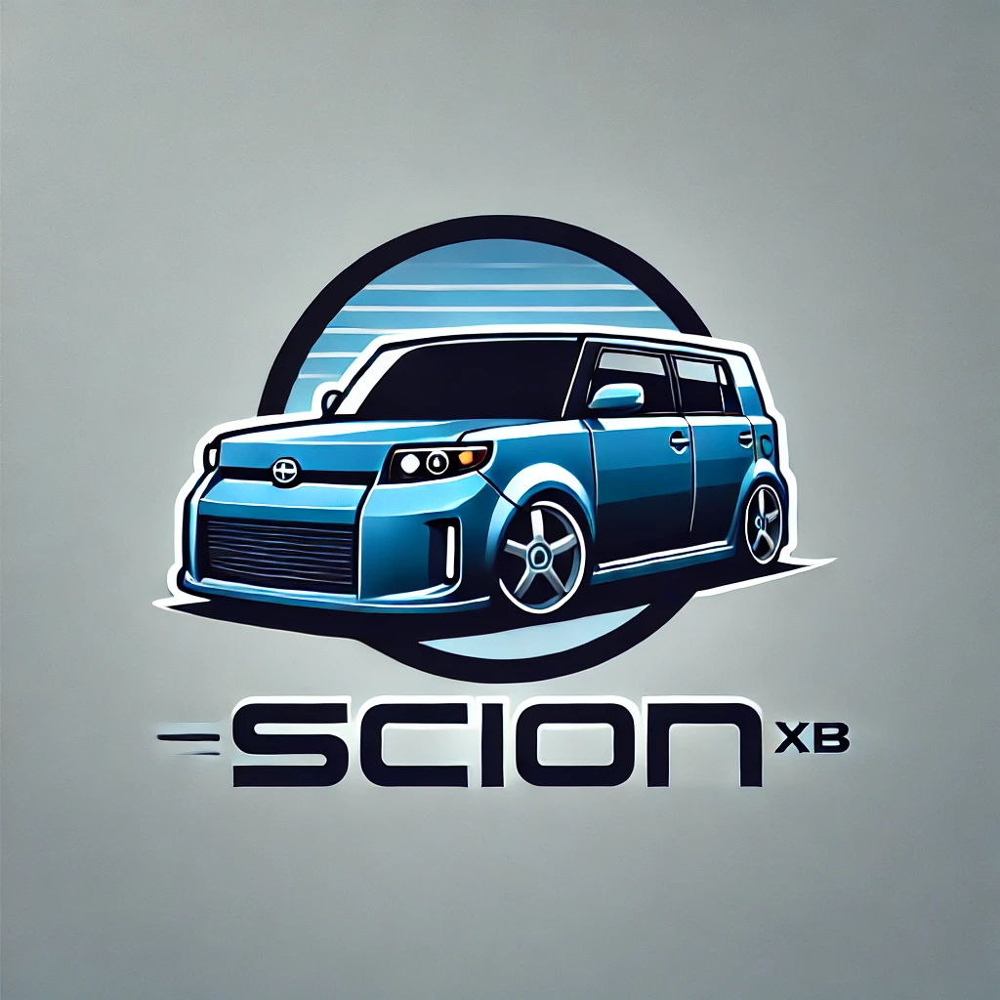

<table cellpadding="10">
<tr>
  <td valign="top" align="center"></td>
  <td align="left" valign="top">
    <h4>About The Scion</h4>
    
I recently (in 2024) bought my second 1st Generation Scion xB. I really like the platform.

    
Yes, I know it's shaped like a toaster. A brick. A square.

    <strong>I don't care.</strong>
  </td>
</tr>
<tr><td colspan="2" align="center" valign="middle">
</td></tr>
<tr>
  <td colspan="2">
    <h4>Posts & Articles</h4>
    <ul>
      
      
        <li><a href="{{ post.url }}"> {{ post.title }}</a></li>
      
    </ul>
  </td>
</tr>
</table>
